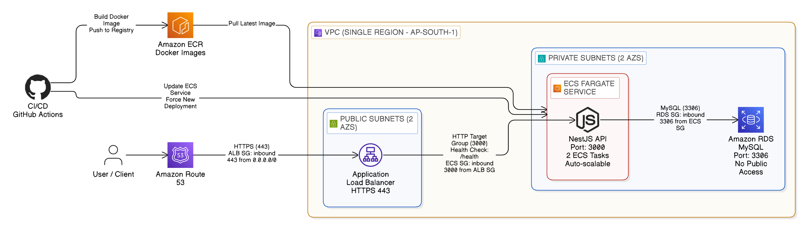

<p align="center">
  
</p>

<h1 align="center">JobFlow API</h1>

<p align="center">
  A production-ready NestJS backend API deployed on AWS ECS Fargate with MySQL database.
</p>

<p align="center">
  
  
  
  
</p>

---

## 📋 Description

JobFlow is a production-ready REST API built with NestJS for job management. It provides user authentication, user management, and job posting/management features.

### Features

- **User Authentication** - JWT-based authentication with login/register
- **User Management** - CRUD operations for users (admin/user roles)
- **Job Management** - Create, read, update, delete job postings
- **Health Monitoring** - Health check endpoint for deployment monitoring

---

## 🏗️ Architecture

### AWS Infrastructure

```
┌─────────────────────────────────────────────────────────────────────────────────────┐
│                         AWS Production-Ready Backend Architecture                   │
└─────────────────────────────────────────────────────────────────────────────────────┘

// Entry point: User/Client
User Client

// DNS Routing
Route 53

// VPC boundary
VPC (ap-south-1 - Mumbai) {

  // Public Subnets (2 AZs)
  Public Subnets (ap-south-1a, ap-south-1b) {
    ALB: jobflow-alb-production-1484565429 (Port 80/HTTP)
  }

  // Private Subnets (2 AZs)
  Private Subnets (10.0.10.0/24, 10.0.20.0/24) {

    // ECS Fargate
    ECS Fargate Cluster: jobflow-cluster-production
    └── NestJS Container: jobflow-api:latest (Port 3000)
        └── 2 Tasks Running

    // RDS MySQL
    RDS MySQL: jobflow-mysql-production
        └── db.t3.micro
        └── Port: 3306
  }
}

// External Services
ECR: jobflow-api (Docker image storage)

// CI/CD Pipeline
GitHub Actions (Auto-deploy on push)
```

### Security Boundaries

| Component | Security                                   |
| --------- | ------------------------------------------ |
| ALB       | Internet-facing, Port 80 open to 0.0.0.0/0 |
| ALB → ECS | Port 3000, via Security Groups             |
| ECS → RDS | Port 3306, ECS SG → RDS SG                 |
| RDS       | Private subnet, No public access           |
| ECS Tasks | No public IP, Private subnets only         |

---

## 🛠️ Tech Stack

| Layer              | Technology                       |
| ------------------ | -------------------------------- |
| **Framework**      | NestJS 11.x                      |
| **Language**       | TypeScript                       |
| **Database**       | MySQL 8.0 (AWS RDS)              |
| **ORM**            | TypeORM                          |
| **Authentication** | JWT (Passport)                   |
| **Container**      | Docker                           |
| **Cloud**          | AWS (ECS Fargate, RDS, ALB, ECR) |
| **CI/CD**          | GitHub Actions                   |
| **Infrastructure** | Terraform                        |

---

## 🚀 Live Deployment

| Resource            | URL/Value                                                                    |
| ------------------- | ---------------------------------------------------------------------------- |
| **API URL**         | http://jobflow-alb-production-1484565429.ap-south-1.elb.amazonaws.com        |
| **Health Endpoint** | http://jobflow-alb-production-1484565429.ap-south-1.elb.amazonaws.com/health |
| **Region**          | ap-south-1 (Mumbai, India)                                                   |
| **ECS Tasks**       | 2 (Fargate)                                                                  |

---

## 📦 Project Setup

### Prerequisites

- Node.js 18+
- npm or yarn
- MySQL (local development)
- Docker (for containerization)

### Installation

```bash
# Clone the repository
git clone https://github.com/Kaushiik-13/jobflow-api.git

# Navigate to project directory
cd jobflow-api

# Install dependencies
npm install
```

### Environment Variables

Create a `.env` file in the root directory:

```env
# Database
DB_HOST=localhost
DB_PORT=3306
DB_USERNAME=root
DB_PASSWORD=your_password
DB_NAME=jobflow_db

# JWT
JWT_SECRET=your_jwt_secret
JWT_EXPIRES_IN=3600
```

### Run the Project

```bash
# Development mode (with hot reload)
npm run start:dev

# Production mode
npm run start:prod

# Build the project
npm run build
```

---

## ✅ Available Scripts

```bash
# Run in development mode
npm run start

# Run in watch mode (hot reload)
npm run start:dev

# Run in production mode
npm run start:prod

# Run tests
npm run test

# Run tests with coverage
npm run test:cov

# Lint code
npm run lint

# Format code
npm run format
```

---

## 📚 API Endpoints

### Authentication

| Method | Endpoint       | Description       |
| ------ | -------------- | ----------------- |
| POST   | /auth/register | Register new user |
| POST   | /auth/login    | Login user        |

### Users

| Method | Endpoint   | Description                |
| ------ | ---------- | -------------------------- |
| GET    | /users     | Get all users (protected)  |
| GET    | /users/:id | Get user by ID (protected) |
| PATCH  | /users/:id | Update user (protected)    |
| DELETE | /users/:id | Delete user (protected)    |

### Jobs

| Method | Endpoint  | Description                |
| ------ | --------- | -------------------------- |
| GET    | /jobs     | Get all jobs (public)      |
| GET    | /jobs/:id | Get job by ID (public)     |
| POST   | /jobs     | Create new job (protected) |
| PATCH  | /jobs/:id | Update job (protected)     |
| DELETE | /jobs/:id | Delete job (protected)     |

### Health

| Method | Endpoint | Description           |
| ------ | -------- | --------------------- |
| GET    | /health  | Health check (public) |

---

## 🔄 CI/CD Pipeline

The project uses GitHub Actions for continuous integration and deployment.

### Workflows

1. **CI (ci.yml)** - Runs on every push to main branch
   - Install dependencies
   - Lint code
   - Build project
   - Run tests

2. **CD (cd.yml)** - Runs after CI succeeds
   - Build Docker image
   - Push to AWS ECR
   - Deploy to ECS Fargate

3. **Terraform (terraform.yml)** - For infrastructure changes
   - Initialize Terraform
   - Plan changes
   - Apply infrastructure

---

## ☁️ AWS Resources

| Resource     | Name                       | Details             |
| ------------ | -------------------------- | ------------------- |
| VPC          | jobflow-vpc-production     | 10.0.0.0/16         |
| ECS Cluster  | jobflow-cluster-production | Fargate             |
| ECS Service  | jobflow-service-production | 2 tasks             |
| ALB          | jobflow-alb-production     | Port 80             |
| Target Group | jobflow-tg-production-v5   | Port 3000           |
| RDS          | jobflow-mysql-production   | MySQL 8.0, t3.micro |
| ECR          | jobflow-api                | Docker registry     |

---

## 📄 License

MIT License - see LICENSE file for details.
